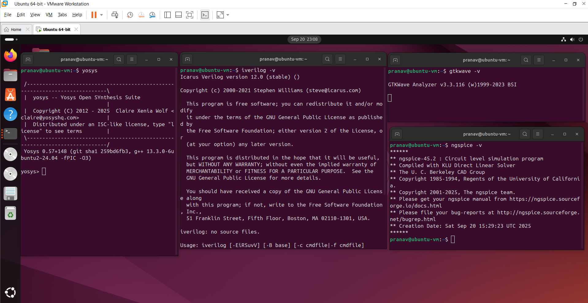

# Tool Check – VLSI Open-Source EDA Setup

This repository provides step-by-step installation instructions for commonly used open-source EDA (Electronic Design Automation) tools.  

## 📌 Tools Covered
- [Yosys](#yosys)
- [Icarus Verilog (iverilog)](#iverilog)
- [GTKWave](#gtkwave)
- [OpenSTA](#opensta-not-needed-for-sfal-participants)
- [Ngspice](#ngspice)
- [Magic](#magic)
- [OpenLANE](#openlane)

---

## Yosys
Yosys is an open-source framework for RTL synthesis.  

```bash
sudo apt-get update
git clone https://github.com/YosysHQ/yosys.git
cd yosys
# If make is not installed
sudo apt install make  

sudo apt-get install build-essential clang bison flex \
libreadline-dev gawk tcl-dev libffi-dev git \
graphviz xdot pkg-config python3 libboost-system-dev \
libboost-python-dev libboost-filesystem-dev zlib1g-dev

make config-gcc
make
sudo make install
```

---

## Iverilog
Icarus Verilog is a Verilog simulation and synthesis tool.  

```bash
sudo apt-get update
sudo apt-get install iverilog
```

---

## GTKWave
GTKWave is a waveform viewer for simulation outputs.  

```bash
sudo apt-get update
sudo apt install gtkwave
```

---

## OpenSTA (not needed for SFAL participants)
OpenSTA is a static timing analysis tool.  

🔗 [OpenSTA GitHub Repository](https://github.com/The-OpenROAD-Project/OpenSTA)

---

## Ngspice
Ngspice is a mixed-level/mixed-signal circuit simulator.  

Download from [Ngspice SourceForge](https://sourceforge.net/projects/ngspice/files/).  

```bash
tar -zxvf ngspice-45.2.tar.gz
cd ngspice-45.2
mkdir release
cd release
../configure --with-x --with-readline=yes --disable-debug
make
sudo make install
```

---

## Magic
Magic is an open-source VLSI layout tool.  

```bash
sudo apt-get install m4
sudo apt-get install tcsh
sudo apt-get install csh
sudo apt-get install libx11-dev
sudo apt-get install tcl-dev tk-dev
sudo apt-get install libcairo2-dev
sudo apt-get install mesa-common-dev libglu1-mesa-dev
sudo apt-get install libncurses-dev

git clone https://github.com/RTimothyEdwards/magic
cd magic
./configure
make
sudo make install
```

---

## OpenLANE
OpenLANE is an automated digital ASIC design flow based on the OpenROAD project.  

### Install Dependencies
```bash
sudo apt-get update
sudo apt-get upgrade
sudo apt install -y build-essential python3 python3-venv python3-pip make git
sudo apt install apt-transport-https ca-certificates curl software-properties-common
```

### Install Docker
```bash
curl -fsSL https://download.docker.com/linux/ubuntu/gpg | sudo gpg --dearmor -o \
/usr/share/keyrings/docker-archive-keyring.gpg

echo "deb [arch=amd64 signed-by=/usr/share/keyrings/docker-archive-keyring.gpg] \
https://download.docker.com/linux/ubuntu $(lsb_release -cs) stable" | sudo tee \
/etc/apt/sources.list.d/docker.list > /dev/null

sudo apt update
sudo apt install docker-ce docker-ce-cli containerd.io
sudo docker run hello-world
```

### Enable Docker for Non-Root Users
```bash
sudo groupadd docker
sudo usermod -aG docker $USER
sudo reboot
```

After reboot:
```bash
docker run hello-world
```

### Check Dependencies
```bash
git --version
docker --version
python3 --version
python3 -m pip --version
make --version
python3 -m venv -h
```

### Install OpenLANE
```bash
cd $HOME
git clone https://github.com/The-OpenROAD-Project/OpenLane
cd OpenLane
make
make test
```

---

## ✅ End of Installation
Once all the tools are installed, you should be ready to begin working with open-source VLSI flows!

---
## 🖼️ Installation Screenshot





